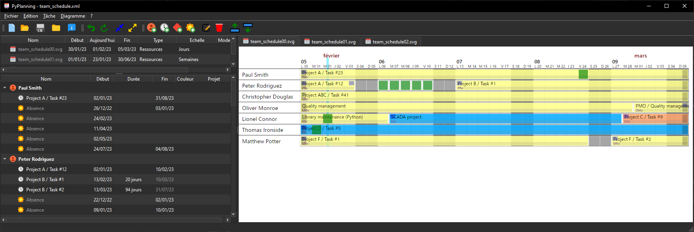

PyPlanning is a small planning tool originally developed by Pierre Raybaut
([CODRA](https://codra.net/)) to manage team schedules and
to quickly create simple project plannings.

# Examples

## Team schedule (daily view)

## Team schedule (tasks view)

## Simple project planning

# Future plans

## High-priority tasks

Fix the following issues:

- FIXME: Treewidget/charts: removing project lead to "" project instead of no value
- TODO: Performance: process only gantt objects affected by changes
- TODO: Performance: update only visible chart? (this is it!)
- TODO: Performance: run chart update in a thread?

## Medium-priority tasks

Implement the following features:

- TODO: Task: add "duplicate" action
- TODO: Task tree widget: add sub-context-menu "Bind to": resources
- TODO: Chart tree widget: add multiple checkboxes to select projects
- TODO: Chart tree widget: add QComboBox for editing the "project" field

## Low-priority tasks

Implement the following features:

- TODO: Add "percent_done" support for tasks
- TODO: Performance: add an option to update on demand?
- TODO: Replace python-gantt (planning/gantt.py) by an alternative with less restrictive
  license terms (no GPL!)

# License

PyPlanning is licensed under the terms of the GPL v3 license. This is prescribed by
the library upon which PyPlanning depends on for generating SVG Gantt plannings
(see GPL-based library code ([python-gantt](https://pypi.org/project/python-gantt/)).
The code of this library has been drastically patched and adapted to PyPlanning needs.
